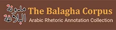

[](https://balagha-corpus.com)
# [Corpus Navigator (v0.1.0)](https://github.com/Balagha-Corpus/Corpus-Navigator/tree/v0.1.0)
### A project of [The Balagha Corpus](https://balagha-corpus.com)

A multi-lingual word position tool for corpus annotation, published by [The Balagha Corpus](https://balagha-corpus.com).


&nbsp;
## ℹ️ About
**Use:** This tool implements standardized rules for numbering words in any text, supporting multiple languages and writing systems. The tool allows for the determination of word position offsets consistently and reliably.

**Requirements:** The tool is a fully stand-alone HTML/Javascript file which can be run on any web browser, and does not need internet access.

**Supports:** RTL languages (Arabic, Hebrew, Persian, Urdu), LTR languages (English, Spanish, etc.), and mixed-direction text. Import / export of CoNLL-style files.

**Applicable to:** Social media posts, tweets, comments, messages, and any text corpus requiring consistent word position verification.


&nbsp;
## ℹ️ How to use
* Download the [CORPUS_NAVIGATOR_v0_1_0.html](/CORPUS_NAVIGATOR_v0_1_0.html) file (also available as a [downloadable asset](https://github.com/Balagha-Corpus/Corpus-Navigator/releases/download/v0.1.0/CORPUS_NAVIGATOR_v0_1_0.html))

  OR

* Access the live version at [The Balagha Corpus](https://balagha-corpus.com/corpus-navigator.html) website.

&nbsp;
## 🔄 Versioning
The Corpus Navigator uses **Semantic Versioning (SemVer)**.

* **v0.1.0 (31 January 2026)** - Initial release (previously known as [Word Position Finder (v0.1.0)](https://doi.org/10.5281/zenodo.18264027)).
	* 21 core rules defined
	* Language-agnostic implementation
	* Support for RTL and LTR scripts
	* Import / export of CoNLL-style files
	* Complete examples provided


&nbsp;
### 📖 How to Cite
**APA:**
Marathe, M. (2026). *Corpus Navigator (v0.1.0)*. The Balagha Corpus. [https://github.com/Balagha-Corpus/Corpus-Navigator/tree/v0.1.0](https://github.com/Balagha-Corpus/Corpus-Navigator/tree/v0.1.0)

**Chicago:**
Marathe, Mandar. *Corpus Navigator v0.1.0*. The Balagha Corpus, 2026. [https://github.com/Balagha-Corpus/Corpus-Navigator/tree/v0.1.0](https://github.com/Balagha-Corpus/Corpus-Navigator/tree/v0.1.0)

**BibTeX:**

```bibtex
@software{corpusnavigator2026,
  author  = {Mandar Marathe},
  title   = {Corpus Navigator},
  year    = {2026},
  version = {0.1.0},
  url     = {https://github.com/Balagha-Corpus/Corpus-Navigator/tree/v0.1.0}
}
```


&nbsp;<br>
---
## 📬 About the Author
**[Dr Mandar Marathe](https://marathe.org)** | [SOAS Profile](https://www.soas.ac.uk/about/mandar-marathe)  
PhD Researcher in Arabic Rhetoric | SOAS University of London  
[](https://project.balaghascore.com)  

### Related Projects
- 📚 [Encyclopedia of Arabic Rhetoric](https://al-balagha.com) - Reference source for Arabic rhetorical devices  
- 💯 [BALAGHA Score](https://balaghascore.com) - Arabic rhetorical density analysis  
- 📖 [Balagha Corpus](https://balagha-corpus.com) - Annotated texts for Arabic rhetorical analysis  
- 📡 [BalaghaBase.org](https://balaghabase.org) - Semantic knowledge graph for Arabic rhetoric  
- 🔬 [Rhetorical Density](https://rhetorical-density.com) - Methodology and discussion of rhetorical density as a quantitative metric  

### Connect
[](https://www.linkedin.com/in/mandar-marathe-uk/) [](https://orcid.org/0000-0002-6927-6836) [](https://scholar.google.com/citations?user=w-bT-iYAAAAJ)  
---
_Last updated: 31 January 2026._  
